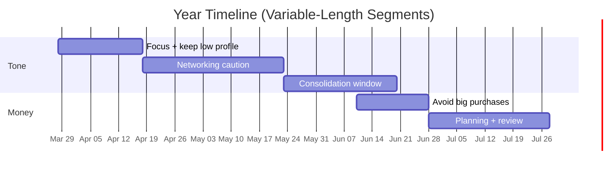

# Deep Research Report on a Single-User Year-Reading App Using Sidereal Astrology, Numerology, and Fortune-Teller Notes

## Executive summary

A robust “year-long life reading” app that feels like a practitioner’s output should generate a **timeline of variable-length date ranges** (e.g., 2–8 week windows), not calendar months. The most defensible engineering pattern is a **hybrid deterministic + interpretive** system:

- A **deterministic computation layer** converts birth data into a **sidereal natal chart** (with configurable ayanamsa and nodes), then computes a year’s **change points** (ingresses, retrograde stations, eclipses, optional Vimshottari dasha boundaries) using a high-precision ephemeris such as Swiss Ephemeris. Swiss Ephemeris explicitly documents its DE431 basis, time coverage, sidereal options, UT/TT handling, node modes, and eclipse routines, and it also documents a dual licensing model (AGPL vs professional license). citeturn5search0turn7view0turn8view0  
- A **segmentation layer** converts change points into **8–18 variable-length segments** via merge rules and min/max segment lengths—mirroring how fortune-tellers often speak in “periods” rather than months.
- An **interpretation layer** maps computed features + imported note patterns into domain themes (work/politics, money/purchases, relationships, health/emotional balance, travel/overseas, study/growth) using a versioned **rule engine** with a **confidence model** that explicitly handles uncertain birth time and OCR ambiguity.
- A **personal calibration layer** (optional but high value for a single-user app) learns your personal mapping from historical note segments (e.g., “planet clash → agitation/communication friction”) to tune weights without becoming a black box.
- A **timeline-first UI** presents segment cards, “why/evidence” drivers, confidence scores, and a note-review editor.

Privacy and compliance are first-class constraints even for single-user tools. Birth date/time/place are personal data; GDPR explicitly includes **location data** in the notion of personal data. citeturn3search0turn3search4 California privacy frameworks and CPRA-related text also highlight **precise geolocation** definitions and additional controls around sensitive information. citeturn3search10turn3search18 Swiss Ephemeris licensing decisions are architecture-shaping: the professional license contract states that even if a distributed app requests calculations from a server, it is still considered an app “containing Swiss Ephemeris.” citeturn8view0

## Assumptions and scope

This report assumes the following when unspecified:

- **Single-user** app, but designed to support multiple profiles later (useful if you store historical readings or compare different people’s notes).  
- **Platform/budget/languages** are open-ended; recommended approach is **local-first** (on-device storage and computation) for privacy, with opt-in cloud services only when needed.
- **Astrology defaults** (all configurable):
  - Zodiac: **sidereal**
  - Ayanamsa: **Lahiri** by default unless user chooses otherwise (Swiss Ephemeris supports multiple sidereal modes). citeturn7view1  
  - Houses: **Whole Sign** as default (Swiss Ephemeris includes Whole Sign house support). citeturn6view0turn5search1  
  - Nodes: Rahu/Ketu **mean vs true configurable** (Swiss Ephemeris defines both). citeturn7view1  
- **Year window** default: birthday-to-birthday (because practitioner notes often anchor “after birthday”), plus options for calendar year or any custom 365-day interval.
- **Interpretation stance**: astrology and numerology are treated as **divinatory/reflection systems**, not scientific prediction. citeturn1search0turn1search5

## Data inputs and ingestion pipeline

### Input fields and validation rules

Swiss Ephemeris explicitly notes that it “still does not provide the time zone for a given place and time,” which means the app must implement its own time zone resolution and historical offset logic. citeturn6view1

**Recommended core inputs**:

| Category | Field | Type | Validation and normalization |
|---|---|---|---|
| Birth data | Birth date | `YYYY-MM-DD` | Must be valid calendar date; store as local date plus computed UTC timestamp |
| Birth data | Birth time (local) | `HH:MM` (optional) | If unknown, set `time_accuracy=unknown`; if approximate, store range or “± minutes” |
| Birth data | Birth place (text) | string | Normalize via geocoding to lat/lng; keep original string for audit |
| Birth data | Latitude/longitude | float | If user supplies, skip geocoding; validate ranges; consider rounding for privacy |
| Birth data | Time zone ID | IANA TZ ID | Resolve via tzdb lookup for location/time; store tzdb version for reproducibility |
| Names | Name(s) | string(s) | Preserve diacritics; optionally store Latin transliteration for letter-mapping systems |
| Notes | Note photos | image files | Hash each file; store capture metadata; run OCR; require user review for low-confidence |
| Notes | Typed/pasted notes | text | Parse date ranges and tags directly; keep raw text as immutable source record |

Time zone correctness is foundational: the entity["organization","IANA","internet authority tzdb"] Time Zone Database (“tzdb/zoneinfo”) explicitly states it represents the **history of local time** and is updated as political bodies change time zone boundaries, UTC offsets, and daylight-saving rules. citeturn0search3

### OCR pipeline for photos of fortune-teller notes

You need two modes to balance privacy and accuracy:

- **Local-first OCR** using Tesseract: Tesseract is an open-source OCR engine under Apache 2.0, usable by command line or API, and can be compiled for multiple targets including mobile. citeturn2search2turn2search10  
- **Opt-in cloud OCR** when handwriting/layout quality is poor:
  - entity["company","Google","us tech company"] Cloud Vision: `DOCUMENT_TEXT_DETECTION` is optimized for dense documents and returns structured JSON with page → block → paragraph → word information (useful for layout-aware parsing). citeturn2search0  
  - entity["company","Amazon Web Services","cloud provider, us"] Textract: designed to detect printed and handwritten text and returns bounding box coordinates for extracted elements; AWS documents bounding boxes and their coordinate semantics. citeturn2search1turn2search5  

**Practical OCR pipeline stages**:

1. **Image preprocessing** (on-device): deskew, contrast normalization, denoise, optional crop.
2. **OCR extraction**: local (Tesseract) by default; cloud (Vision/Textract) only with explicit consent.
3. **Post-processing**:
   - date-range extraction
   - entity/tag extraction (domain tags like finance/work/health)
   - assign confidence (`ocr_confidence × parser_confidence × user_confirmation`)
4. **Human-in-the-loop review**: required for any segment below threshold (e.g., confidence < 0.85) or for any cross-year date range.

### Date-range parsing and normalization to “note segments”

Your fortune-teller notes likely represent windows driven by transit/events rather than calendar months. The app must therefore parse arbitrary ranges:

- Formats: “Mar 16 to Apr 22”, “Dec 27 – Feb 4”, “until Jan 24, 2025”, “after birthday…”
- Year inference: if year absent, infer using the nearest plausible date inside the target year window but mark inference explicitly (confidence penalty).

Normalized structure: `NoteSegment = {start_date, end_date, label, domains[], advice_tags[], reason_tokens[], confidence, source_asset_id}`.

## Required computation layer: sidereal astrology and numerology

### Sidereal astrology computations

#### Ephemeris basis and DE431 context

Swiss Ephemeris is described as a high-precision ephemeris developed by entity["company","Astrodienst AG","zollikon, switzerland"] and since release 2.00 is based on JPL’s DE431 ephemeris; it states coverage from **13201 BC to AD 17191** and describes a compressed ephemeris reproducing JPL data with **0.001 arcseconds** precision, while also supporting use of original JPL files or a built-in semi-analytic theory. citeturn5search0  
entity["organization","NASA","us space agency"]’s entity["organization","Jet Propulsion Laboratory","nasa center, pasadena ca"] documentation explains DE430/DE431 are generated by fitting numerically integrated orbits to observations and notes accuracy characterizations (e.g., submeter lunar orbit near present through LLR fits and subkilometer inner-planet orbit knowledge via spacecraft tracking). citeturn0search2turn0search6  
The NAIF/JPL report further notes DE431’s long span (–13,200 to +17,191) and that it is less accurate near the current epoch than DE430 due to modeling differences, but more suitable for times outside DE430’s centuries-scale focus. citeturn0search6  

#### UT vs TT, Julian day, and Delta‑T handling

Swiss Ephemeris’ programmer documentation states that `swe_calc_ut()` expects UT, while `swe_calc()` expects TT (Ephemeris Time); it further says that for “common astrological calculations,” you generally only need `swe_calc_ut()` and do not need to worry about UT↔TT conversion. citeturn7view0turn7view1  
The same documentation defines that `tjd_et = tjd_ut + swe_deltat(tjd_ut)` and documents Delta‑T related functions including `swe_deltat_ex()`. citeturn7view1turn7view2

**Implementation assumption**: use `swe_calc_ut()` for most natal/transit computations; adopt `swe_deltat_ex()` where you explicitly need TT-level rigor (e.g., high-precision event boundary search), and store the ephemeris flags and Delta‑T approach per reading for reproducibility. citeturn7view0turn7view2

#### Natal chart outputs and configuration defaults

Minimum natal outputs (stored, cached, reproducible):

- Sidereal longitudes (and optionally speed) for Sun, Moon, Mercury, Venus, Mars, Jupiter, Saturn; optionally Uranus/Neptune/Pluto if your practitioner uses them (Swiss Ephemeris enumerates these bodies as constants). citeturn7view1  
- Ascendant and houses: Whole Sign by default; Swiss Ephemeris includes Whole Sign (“W”) and documents it was implemented explicitly as a supported method. citeturn6view0turn5search1  
- Rahu/Ketu mode: Swiss Ephemeris defines both `SE_MEAN_NODE` and `SE_TRUE_NODE` constants; default must be user-configurable. citeturn7view1turn7view3  
- Nakshatras: compute Moon’s nakshatra index and fraction; Britannica describes nakshatras as 27 lunar mansions used in Hindu astrology. citeturn0search2turn1search0turn1search5  

image_group{"layout":"carousel","aspect_ratio":"1:1","query":["nakshatra wheel 27 lunar mansions chart","Vimshottari dasha 120 years table chart","whole sign houses 12 houses diagram"],"num_per_query":1}

#### Vimshottari dashas and sub-periods

To generate practitioner-like “periods,” Vimshottari is especially useful because it produces discrete windows. Classical Jyotisha sources (and common English translations) describe Vimshottari as a 120-year framework with defined maha-dasha durations for the nine grahas and proportional rules for sub-periods. citeturn0search6turn5search0  
Engineering requirement: store the algorithm variant (e.g., how you compute “balance of dasha” from Moon’s nakshatra fraction), because implementations differ across traditions.

#### Year calculations: transits, ingresses, retrogrades/stations, eclipses

Swiss Ephemeris documents that `swe_calc_ut()` returns long/lat/distance and can return speed components, including speed in longitude—enabling **deterministic retrograde and station detection** by sign changes around zero longitude speed. citeturn7view1turn7view0  
Swiss Ephemeris also documents eclipse calculation functions (e.g., finding next local/global solar eclipse and lunar eclipse, computing attributes, computing eclipse path). citeturn5search11turn5search8turn7view1  

**Event types to compute as “change points”** (used downstream for segmentation):

- Sign ingresses (especially slower bodies and nodes)
- Retrograde stations (Mercury/Mars etc.)
- Eclipse maximum times and optionally local circumstances
- Dasha boundary times (maha/antar/pratyantar—configurable depth)

### Numerology computations

Britannica defines numerology as using numbers to interpret a person’s character or to divine the future, and traces common theory to Pythagorean ideas about the reducibility of reality to numbers—useful for framing the logic and disclaimers in the app. citeturn1search5turn4search21  

#### Required numerology methods and configuration

- **Life Path**: reduce birth date digits to a single digit or master number based on configuration.
- **Personal Year**: typical formula sums birth month + birth day + target year digits, then reduces.
- **Name numerology**: must be configurable because mapping systems differ.

##### Pythagorean and Chaldean letter mappings (engineering posture)

There is no universally “official” chart; these are practitioner conventions. A rigorous app should:
1) store mapping tables as data, 2) cite which mapping table was applied, and 3) let you switch mappings and preserve reproducibility.

Sources describing commonly-used mappings:
- Pythagorean mapping (A=1… I=9, then repeat) is described in practitioner references such as dCode. citeturn4search5  
- Chaldean mapping (1–8, often excluding 9 from letter assignment) is described in practitioner references such as Astroyogi. citeturn4search20  
- Wikipedia’s overview notes that various numerology systems assign numeric values to letters and mentions the “Pythagorean method” assigns values 1–9 repeatedly; treat this as background rather than normative authority. citeturn4search4  

##### Master-number rules

The correct engineering decision is to make master-number handling explicit and configurable, because it changes outputs:
- preserve 11/22/33
- preserve 11/22
- preserve none

Each reading must store the rule set used.

## Mapping computations into variable-length yearly themes

### Segment generation from change points

To emulate non-calendar “period” readings, segments should be generated by computed change points:

1. Collect and sort change points in the target window (birthday-to-birthday default).
2. Create candidate segment boundaries at each change point and at window start/end.
3. Apply merge rules to avoid micro-segments:
   - merge boundaries within `merge_within_days` (e.g., 3–5 days)
4. Enforce bounds:
   - `min_segment_days` (e.g., 10)
   - `max_segment_days` (e.g., 60)
5. Target 8–18 segments/year for usability.

**Suggested segmentation parameters** (tunable):

| Parameter | Typical default | Rationale |
|---|---:|---|
| `merge_within_days` | 4 | Prevents “noise” from clustered events |
| `min_segment_days` | 10 | Avoids unreadable micro-windows |
| `max_segment_days` | 60 | Avoids overly broad periods |
| `target_segment_count` | 8–18 | Balance detail vs cognitive load |
| `eclipse_influence_days` | 7–21 | Practitioners often treat eclipses as having a window |

### Mapping rules: placements/events → domains and “stance tags”

A rigorous approach is to formalize interpretation as a **versioned ruleset**:

- Rules are additive and produce:
  - `domain_scores` (0–10 per domain)
  - `tone_score` (e.g., –1 to +1)
  - `stance_tags` (low_profile, meticulous, network, avoid_big_purchases, rest)
  - `watchouts`
  - `evidence` list (which drivers triggered)

Rules should be editable and traceable (RuleSet v1 → v2), because interpretive mappings are cultural/practitioner-dependent.

**Evidence-first output** is essential to user trust: each segment should show “why this window exists” (eclipse overlap, station, ingress, dasha boundary, etc.). Eclipse functions and planetary speed outputs are explicitly supported by Swiss Ephemeris APIs, making such evidence lists technically grounded. citeturn5search11turn7view1  

### Weighting, confidence scoring, and ambiguous data

A confidence model should incorporate:

- Birth time accuracy (dominant factor for house-based claims)
- Boundary sensitivity (planet or ascendant near sign/house boundary)
- Event precision (eclipse and station times computed precisely vs approximated)
- OCR/parser certainty for imported note segments

Swiss Ephemeris documentation explicitly differentiates UT vs TT usage and documents Delta‑T functions and the conversion relationship; these are the exact kinds of dependencies that should surface in a “calculation confidence” model. citeturn7view0turn7view2  

### Personal calibration from historical note segments

Single-user apps can gain outsized value by learning your personal mappings:

- Convert historical notes into `NoteSegment` labels (tone, domains, stance tags).
- For each historical segment, compute feature vectors from natal + transits + events.
- Fit a small interpretable model (e.g., regularized logistic regression) to adjust rule weights.

Calibration should be limited to **weight tuning**, not end-to-end generation, so the app remains auditable and you can see which drivers changed.

## Data model, sources/APIs, and algorithm blueprint

### Prioritized authoritative sources and APIs

This list prioritizes the sources you requested and prefers primary/official documentation.

| Priority | Area | Source/API | Why it’s authoritative |
|---:|---|---|---|
| 1 | Ephemeris + licensing | Swiss Ephemeris “General Information / Licensing” | DE431 basis, time range, compression precision, and dual-licensing requirements. citeturn5search0 |
| 2 | Implementation details | Swiss Ephemeris Programmer’s Manual (`swephprg`) | UT vs TT, `swe_calc_ut` vs `swe_calc`, Delta‑T functions, node constants, sidereal flags, eclipse functions. citeturn7view0turn7view1turn7view2 |
| 3 | Professional license specifics | Swiss Ephemeris professional license contract | Explicit server/distributed-app interpretations and obligations. citeturn8view0 |
| 4 | Ephemeris theory | JPL DE430/DE431 docs | Primary explanation of how DE430/DE431 are generated and accuracy context. citeturn0search2turn0search6 |
| 5 | Time zone truth set | IANA tzdb | Canonical dataset for historical local time and DST changes. citeturn0search3 |
| 6 | Context/definitions | entity["organization","Encyclopaedia Britannica","encyclopedia publisher"] astrology/numerology entries | Clear definitions supporting disclaimers and framing. citeturn1search0turn1search5 |
| 7 | Web app security verification | entity["organization","OWASP Foundation","application security nonprofit"] ASVS | Security requirements baseline and verification guidance. citeturn1search2 |
| 8 | Security/privacy controls | entity["organization","National Institute of Standards and Technology","us standards agency"] SP 800-53 Rev.5 | Authoritative catalog of security & privacy controls. citeturn1search3 |
| 9 | Digital identity guidance | NIST SP 800-63-4 | Guidance if you add accounts/sync/identity proofing; includes security/privacy considerations. citeturn3search17turn3search1 |
| 10 | OCR (local) | Tesseract documentation | Open-source OCR engine, local-first, Apache 2.0 licensing. citeturn2search2 |
| 11 | OCR (cloud opt-in) | Google Vision handwriting OCR | `DOCUMENT_TEXT_DETECTION` and structured outputs. citeturn2search0 |
| 12 | OCR (cloud opt-in) | AWS Textract OCR | Printed + handwriting; bounding boxes returned for auditability. citeturn2search1turn2search5 |

### Proposed schema: inputs and outputs

| Table | Core fields | Notes |
|---|---|---|
| `person` | `person_id`, `display_name`, `created_at` | Single user now; supports future profiles |
| `birth_data` | `person_id`, `birth_date`, `birth_time_local`, `time_accuracy`, `birth_place_text`, `lat`, `lng`, `timezone_id`, `tzdb_version` | tzdb required because Swiss Ephemeris doesn’t supply time zones. citeturn6view1turn0search3 |
| `name_record` | `person_id`, `name_type`, `name_text`, `locale`, `active` | Store multiple names; select per mapping system |
| `note_asset` | `asset_id`, `person_id`, `asset_type(image/text)`, `blob_ref`, `ocr_engine`, `ocr_text`, `ocr_confidence`, `created_at` | Keep raw OCR for audit |
| `note_segment` | `segment_id`, `person_id`, `start_date`, `end_date`, `severity`, `domain_tags`, `advice_tags`, `reason_tokens`, `confidence`, `asset_id` | Normalized fortune-teller “period” records |
| `astro_config` | `config_id`, `ayanamsa`, `house_system`, `node_mode`, `flags_json`, `dasha_depth` | Reproducibility across reruns |
| `astro_natal` | `person_id`, `config_id`, `computed_at`, `planet_positions_json`, `houses_json`, `nakshatra_json`, `dasha_seed_json` | Cached natal outputs |
| `astro_event` | `event_id`, `plan_id`, `event_type`, `t_start_utc`, `t_end_utc`, `details_json`, `weight` | Ingress/station/eclipse/dasha boundary |
| `year_plan` | `plan_id`, `person_id`, `start_date`, `end_date`, `anchor_type`, `config_id` | The 365-day window |
| `year_segment` | `segment_id`, `plan_id`, `start_date`, `end_date`, `domain_scores_json`, `tone_score`, `drivers_json`, `confidence` | Produced by segmentation + scoring |
| `reading_statement` | `statement_id`, `segment_id`, `text`, `domains`, `priority`, `evidence_json`, `confidence` | Final narrative with evidence |

### Algorithm outline and pseudocode

```text
FUNCTION build_year_reading(person_id, year_window, astro_config, numerology_config):

  # 1) Load and validate inputs
  birth = load_birth_data(person_id)
  names = load_names(person_id)
  notes = load_note_segments(person_id)

  # 2) Normalize time/place (tzdb-backed)
  latlng = resolve_latlng(birth.birth_place_text, birth.lat, birth.lng)
  tzid = resolve_timezone_id(latlng, birth.birth_date, birth.birth_time_local)  # uses tzdb
  birth_ut = local_time_to_UT(birth.birth_date, birth.birth_time_local, tzid, birth.time_accuracy)

  # 3) Compute natal (sidereal)
  natal = swiss_eph_compute_natal(
            birth_ut, latlng,
            ayanamsa=astro_config.ayanamsa,
            house_system=astro_config.house_system,
            node_mode=astro_config.node_mode)

  # 4) Compute numerology (Life Path, Personal Year, Name)
  numer = compute_numerology(birth.birth_date, names, numerology_config)

  # 5) Compute change points (events)
  events = []
  events += compute_ingresses(year_window, natal, astro_config)
  events += compute_retrograde_stations(year_window, astro_config)  # via speed sign-change
  events += compute_eclipses(year_window, astro_config)             # Swiss Eph eclipse routines
  if astro_config.dasha_depth != "none":
      events += compute_vimshottari_boundaries(year_window, natal, astro_config.dasha_depth)

  # 6) Build variable-length segments
  segments = build_segments(year_window, events,
                            merge_within_days=4,
                            min_days=10,
                            max_days=60,
                            target_count=(8..18))

  # 7) Score segments with rule engine + (optional) calibration
  base_rules = load_ruleset(version="v1")
  calibration = fit_calibration_model(notes, natal)  # optional
  for seg in segments:
      drivers = derive_drivers(seg, natal, numer, events)
      scores = apply_rules(base_rules, drivers)
      scores = apply_calibration(scores, calibration)
      confidence = compute_confidence(birth.time_accuracy, drivers, seg, notes)
      seg.output = {scores, drivers, confidence}

  # 8) Render narrative + templates
  return render_report(natal_summary=natal, numerology=numer, timeline=segments)
```

## UI/UX and output templates

### Timeline-first UI (designed for repeated check-ins)

A practitioner-style reading becomes useful when it is **easy to consult mid-year**. A recommended UI consists of:

- **Year overview**: macro themes + configuration snapshot + “big caution windows”
- **Timeline view**: scrollable segment cards (variable durations)
- **Segment card**: tone, domain scores, watch-outs, stance, “why” drivers, confidence
- **Note review editor**: image + OCR + extracted segments + quick correction tools
- **Export**: JSON (for diffing) + PDF summary

### Sample templates

**Year overview (rendered)**

- Window: `{start_date} → {end_date}` (Anchor: `{birthday|calendar|custom}`)
- Astrology config: sidereal `{ayanamsa}`, houses `{house_system}`, nodes `{mean|true}`, dasha `{depth}`
- Numerology config: mapping `{pythagorean|chaldean}`, master numbers `{policy}`
- Macro themes (top drivers):
  - `{theme_1}` — evidence: `{driver_list}`
  - `{theme_2}` — evidence: `{driver_list}`
  - `{theme_3}` — evidence: `{driver_list}`
- Numerology tone:
  - Life Path: `{n}`
  - Personal Year: `{n}`

**Segment card (rendered)**

- Dates: `{seg_start} → {seg_end}`
- Tone: `{Good|Average|Stressful}` (Confidence: `{0–100}%`)
- Domains:
  - Work/Politics: `{0–10}`
  - Money/Purchases: `{0–10}`
  - People/Networking: `{0–10}`
  - Health/Emotional: `{0–10}`
  - Overseas/Travel: `{0–10}`
  - Study/Growth: `{0–10}`
- Watch-outs:
  - `{watchout_1}`
  - `{watchout_2}`
- Recommended stance:
  - `{stance_1}`
  - `{stance_2}`
- Why this window exists:
  - `{event_1}` (type: station/ingress/eclipse/dasha boundary)
  - `{event_2}`
- Notes overlay (optional):
  - “Similar to your past note window `{date_range}` labeled `{label}`.”

### Mermaid Gantt for visualization (export-friendly)



## Privacy, security, validation, and ethical/legal considerations

### Privacy and security posture

Birth data (including place) is personal data; GDPR’s definition of personal data explicitly includes identifiers such as **location data**. citeturn3search0turn3search4  
California privacy guidance emphasizes that *sensitive personal information* is a subset of personal information and provides consumer rights to limit its use/disclosure. citeturn3search18 CPRA text defines “precise geolocation” using the 1,850‑foot radius criterion. citeturn3search10

**Local-first default design**:
- On-device storage for birth data, computed charts, and note images
- On-device computation for astrology and numerology when feasible
- Cloud OCR/geocoding/timezone lookups **opt-in** with explicit consent screens and “delete after extraction” toggles

**Logging and redaction**:
- Never log birth time/place, lat/lng, OCR text, or note images.
- Store only hashed identifiers in analytics (or no analytics for single-user).

### Security controls and standards mapping

- OWASP ASVS provides a basis for testing web application technical security controls and a requirements list for secure development. citeturn1search2  
- NIST SP 800‑53 provides a catalog of security and privacy controls for systems and organizations. citeturn1search3  
- NIST SP 800‑63‑4 provides digital identity guidelines if you later add authentication/sync. citeturn3search17turn3search1  
- If you build a mobile app, OWASP MASVS provides mobile-specific security requirements and testing expectations. citeturn3search3turn3search7  

### Validation/testing plan and metrics

A rigorous plan validates (1) astronomical correctness, (2) OCR + parsing correctness, (3) segmentation quality, and (4) user usefulness.

| Component | Tests | Metrics |
|---|---|---|
| Time zone & local→UT conversion | DST ambiguity cases; historical TZ changes; round-trip tests | Conversion correctness; % ambiguous cases requiring user choice |
| Swiss Ephemeris integration | Golden-reference tests for longitudes; regression snapshots | Max absolute longitude error vs reference; determinism across builds |
| UT vs TT / Delta‑T | Ensure consistent function use (`swe_calc_ut` vs `swe_calc`); Delta‑T updates | Stable event boundaries; documented Delta‑T versioning in outputs citeturn7view0turn7view2 |
| Retrogrades/stations | Detect sign change in longitude speed | Station detection recall (no missed stations) using computed speed outputs citeturn7view1 |
| Eclipses | Validate count/timing within window | Event count match; timing tolerance (minutes/hours) for max eclipse times citeturn5search11turn7view1 |
| OCR accuracy | Labeled dataset from your note photos | CER/WER; calibration curve for OCR confidence citeturn2search0turn2search1turn2search2 |
| Date-range extraction | Unit tests on diverse formats, cross-year spans | Precision/Recall/F1 for extracted ranges |
| Segmentation generator | Constraints enforcement tests | Segment count (8–18), % segments below min length (target 0), % over max length |
| Usefulness evaluation (single user) | In-app rating per segment | Mean usefulness 1–5; “why clarity” score; revisit frequency |

### Ethical framing and disclaimers

Because Britannica frames astrology as divination and numerology as divinatory interpretation using numbers, the app should clearly present itself as a **reflection and awareness tool**, not medical/legal/financial advice. citeturn1search0turn1search5  
Practical safeguards:
- “Entertainment/reflection” disclaimer on every export.
- Avoid prescriptive claims (“do not invest”); favor reflective prompts (“double-check major decisions during this window”).
- Show confidence and uncertainty drivers (birth time accuracy, boundary sensitivity, OCR ambiguity).

### Swiss Ephemeris licensing and architecture implications

Swiss Ephemeris is dual-licensed; the Swiss Ephemeris general documentation states you must choose between AGPL and the professional license before distributing software and before activating public services. citeturn5search0turn6view1  
The professional license contract explicitly states that even if a distributed app contains no calculation code and requests calculations from a server, it is still considered an app containing Swiss Ephemeris. citeturn8view0  

**Implication**: if you want maximal future flexibility, a local-first architecture is the simplest. If you later want cloud computation or distribution, treat licensing choice as a product milestone and design your computation layer to be swappable.